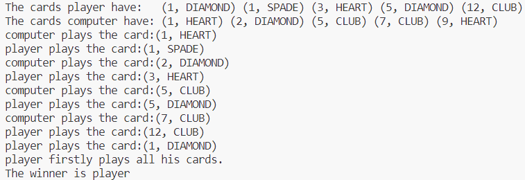
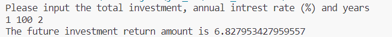
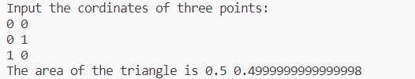

# Java 第一次实验

## 编程训练

### 内容规定

模拟玩家和计算机进行纸牌游戏。这里使用规则如下：

+ 先手先打出一张牌
+ 后手接着打出一张大于它的牌
+ 然后依次轮回，直到有一个人找不到比前一个人打出的牌更大的牌，此时让前一个人得到主动权，可以继续打一张牌。
+ 若一个人率先打完了所有的牌，那么他获得胜利。

这里的牌的大小规则是：首先大小王比任何牌打，大王大于小王，其次按照数字顺序，如果数字相同，则按照黑桃（SPADE）>红桃（HEART）>方块（DIAMOND）>梅花（CLUB）的顺序比较。

**简化** 为了简化内容，我们规定，每个人只会打出最小的，比前一个人打出的牌大的牌，第一个人会打出拥有的最小的牌。

### 代码

```java
public class Main {
    public static void main(String[] args) {
        Card[] cards = generateCard();
        int n = cards.length;
        Player player, computer;
        player = new Player("player");
        computer = new Player("computer");
        // distribute cards and find the player go first.
        int starter = 1;
        Card startCard = new Card(3, COLOR.SPADE);
        for (int i = 0; i < 5; ++i) {
            int pos = rand(0, n - 1);
            player.cards[i] = cards[pos];
            cards[pos] = cards[n - 1];
            --n;
            if (player.cards[i] == startCard) starter = 0;
            pos = rand(0, n - 1);
            computer.cards[i] = cards[pos];
            cards[pos] = cards[n - 1];
            --n;
            if (computer.cards[i] == startCard) starter = 1;
        }
        player.sort();
        computer.sort();
        System.out.print("The cards player have:   "); player.Print();
        System.out.print("The cards computer have: "); computer.Print();
        Player winner;
        if (starter == 0) winner = Start(player, computer);
        else winner = Start(computer, player);
        System.out.println("The winner is " + winner.name);
    }
    public static Card[] generateCard() {
        Card[] cards = new Card[54];
        int n = 0;
        for (int i = 1; i <= 13; ++i) {
            for (int j = 0; j < 4; ++j) {
                cards[n] = new Card(i, COLOR.values()[j]);
                ++n;
            }
        }
        cards[n++] = new Card(14, COLOR.Joker1);
        cards[n++] = new Card(15, COLOR.Joker2);
        return cards;
    }
    /**
     * get the random int between [a, b].
     * @param a the lower bound of range
     * @param b the upper bound of range
     * @return a random int between [a, b]
     */
    static int rand(int a, int b) {
        return (int)(Math.random() * (b - a + 2)) + a;
    }
    /**
     * player1 and player2 play cards with each other, with the rule below:<br>
     * <ul><li>player1 go first, and play a card from his hand
     * <li>player2 try to catch the card, that is play a higher card, then its turn to player1.
     * <li>If the player can't catch the card, the other player can lay down another card he has, and cycle this progress.
     * </ul>
     * When player firstly plays all his cards, he will be the winner.<br>
     * To simplify the question, every one will lay down the smallest card that satisfy the requirement.
     * 
     * @param player1 who is go first.
     * @param player2 who is go second.
     * @return the player who is the winner.
     */
    static Player Start(Player player1, Player player2) {
        while (player1.hasChoice() && player2.hasChoice()) {
            boolean roundResult = true;
            // in each round:
            Card lastCard = new Card(0, null);
            while (player1.hasChoice() && player1.hasChoice()) {
                lastCard = player1.playCard(lastCard);
                if (lastCard == null) {
                    roundResult = false;
                    break;
                }
                System.out.print(player1.name + " plays the card:");
                lastCard.Print(); System.out.println();
                if (!player1.hasChoice()) break;
                lastCard = player2.playCard(lastCard);
                if (lastCard == null) {
                    roundResult =  true;
                    break;
                }
                System.out.print(player2.name + " plays the card:");
                lastCard.Print(); System.out.println();
                if (!player2.hasChoice()) break;
            }
            if (player1.hasChoice() == false) {
                System.out.println(player1.name + " firstly plays all his cards.");
                return player1;
            }
            if (player2.hasChoice() == false) {
                System.out.println(player2.name + " firstly plays all his cards.");
                return player2;
            }
            if (roundResult == false) {
                Player p = player1;
                player1 = player2;
                player2 = p;
            }
        }
        if (player1.hasChoice() == false) {
            System.out.println(player1.name + " firstly plays all his cards.");
            return player1;
        } else {
            System.out.println(player2.name + " firstly plays all his cards.");
            return player2;
        }
    }
}
enum COLOR {SPADE, HEART, DIAMOND, CLUB, Joker1, Joker2};
class Card {
    int number;
    // The int value 1 2 3 ... 13 of the variable number represents the cards: Ace, 2, 3, ... 10, Jack, Queen, King.
    COLOR color;

    Card(int number, COLOR color) {
        this.number = number;
        this.color = color;
    }

    private static boolean CompareColor(COLOR col1, COLOR col2) {
        if (col1 == COLOR.SPADE) return true;
        if (col2 == COLOR.SPADE) return false;
        if (col1 == COLOR.HEART) return true;
        if (col2 == COLOR.HEART) return false;
        if (col1 == COLOR.DIAMOND) return true;
        if (col2 == COLOR.DIAMOND) return false;
        if (col1 == COLOR.CLUB) return true;
        if (col2 == COLOR.CLUB) return false;
        return true;
    }

    public void Print() {
        System.out.printf("(%d, %s)", this.number, this.color);
    }

    /**
     * Compare two cards. Firstly the Joker2 is the largest, and the Joker1 is the second largest. If two cards have different numbers, then the card have larger number is considered the bigger one. If two cards have equal number, it will follow the rule: SPADE > HEARD > DIAMOND > CLUB.
     * @param c1 Card to compare.
     * @param c2 Card to compare.
     * @return true if c1 is larger or equal than c2; false if c1 is less then c2.
     */
    public static boolean Compare(Card c1, Card c2) {
        if (c1.color == COLOR.Joker2) return true;
        if (c2.color == COLOR.Joker2) return false;
        if (c1.color == COLOR.Joker1) return true;
        if (c2.color == COLOR.Joker2) return false;
        if (c1.number != c2.number) return c1.number > c2.number;
        else return CompareColor(c1.color, c2.color);
    }
}
class Player {
    Card[] cards;
    boolean[] hasPlayed;
    String name;
    Player(String name) {
        this.cards = new Card[5];
        this.hasPlayed = new boolean[5];
        for (int i = 0; i < 5; ++i) this.hasPlayed[i] = false;
        this.name = name;
    }

    /**
     * sort the cards the player has in increasing order
     */
    public void sort() {
        for (int i = 0; i < 5; ++i) {
            for (int j = i + 1; j < 5; ++j) {
                if (Card.Compare(cards[i], cards[j])) {
                    Card temp = cards[i];
                    cards[i] = cards[j];
                    cards[j] = temp;
                }
            }
        }
    }
    public boolean hasChoice() {
        for (int i = 0; i < 5; ++i) {
            if (hasPlayed[i] == false) return true;
        }
        return false;
    }
    /**
     * Find the smallest Card player has which is bigger than Card c.
     * @param c The Card need to bigger than.
     * @return the smallest Card player has which is bigger than Card c.
     */
    public Card playCard(Card c) {
        for (int i = 0; i < 5; ++i) {
            if (!hasPlayed[i] && Card.Compare(cards[i], c)) {
                hasPlayed[i] = true;
                return cards[i];
            }
        }
        return null;
    }
    public Card playCard() {
        for (int i = 0; i < 5; ++i) {
            if (!hasPlayed[i]) {
                hasPlayed[i] = true;
                return cards[i];
            }
        }
        return null;
    }
    public boolean haveCard(Card c) {
        for (int i = 0; i < 5; ++i)
            if (cards[i].equals(c)) return true;
        return false;
    }
    public void Print() {
        for (int i = 0; i < 5; ++i) {
            cards[i].Print();
            System.out.print(' ');
        }
        System.out.println();
    }
}
```

### 运行截图



## 实验任务

### 实验1

根据投资总额、年利率和年数，然后使用公式计算并输出未来投资回报金额。

代码：

```java
import java.util.Scanner;

public class Invest {
    public static void main(String[] args) {
        Scanner input = new Scanner(System.in);
        double totInvest, annualRate, years, future, monthlyRate;
        System.out.println("Please input the total investment, annual intrest rate (%) and years");
        totInvest = input.nextDouble();
        annualRate = input.nextDouble() / 100;
        years = input.nextDouble();
        monthlyRate = annualRate / 12;
        future = totInvest * Math.pow(1 + monthlyRate, years * 12);
        System.out.println("The future investment return amount is " + future);
        input.close();
    }
}
```

运行截图：



### 实验2

输入三角形三个点的x、y坐标，然后计算并显示其面积。

说明：这里使用两种方法进行计算，一种是海伦公式（即要求中给出的公式），另一种是二维坐标的叉乘。

代码：

```java
import java.util.Scanner;

public class Triangle {
    public static void main(String[] args) {
        Point A, B, C;
        A = new Point();
        B = new Point();
        C = new Point();
        System.out.println("Input the cordinates of three points:");
        Scanner input = new Scanner(System.in);        
        A.Input(input);
        B.Input(input);
        C.Input(input);
        Point AB = B.Minus(A);
        Point AC = C.Minus(A);
        Point BC = C.Minus(B);
        double Area = 0.5 * Math.abs(AB.Cross(AC));
        double a = BC.length(), b = AC.length(), c = AB.length();
        double p = (a + b + c) / 2;
        double Area2 = Math.sqrt(p * (p - a) * (p - b) * (p - c));
        System.out.println("The area of the triangle is " + Area + " " + Area2);
    }
}
class Point {
    double x, y;
    Point() {
        x = y = 0;
    }
    Point(double x, double y) {
        this.x = x;
        this.y = y;
    }
    public void Input(Scanner input) {
        this.x = input.nextDouble();
        this.y = input.nextDouble();
    }
    public void Print(String format) {
        System.out.printf("(%f, %f)"+format, x, y);
    }
    public void Print() {
        System.out.printf("(%f, %f)", x, y);
    }
    public Point Minus(Point other) {
        return new Point(this.x - other.x, this.y - other.y);
    }
    public Point Plus(Point other) {
        return new Point(this.x + other.x, this.y + other.y);
    }
    public Point Dot(double k) {
        return new Point(this.x * k, this.y * k);
    }
    public double Cross(Point other) {
        return this.y * other.x - this.x * other.y;
    }
    public double length() {
        return Math.sqrt(this.x * this.x + this.y * this.y);
    }
}
```

运行截图：



第一个面积是由叉乘公式计算得到，第二个面积是由海伦公式计算得到。经过比较，可以看出，海伦公式在实际运算中损失精度较大。